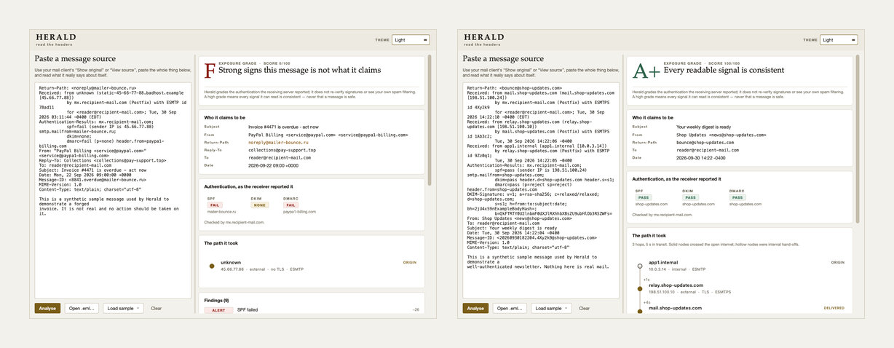

<div align="center">


<picture>
  <source media="(prefers-color-scheme: dark)" srcset="images/banner-dark.png">
  
</picture>

<br>

**An offline reader for e-mail headers: it redraws the route a message took, reports the authentication the receiving server recorded, and grades what it finds — without ever calling a message safe.**

<br>


</div>

---

## Why

Nobody reads an e-mail's headers. They read one line — the name in the *From*
field — recognise it, and act. That line is the cheapest thing in a message to
write, and it is the only part a phishing e-mail needs you to believe.

Everything behind it is harder to fake. Each server that handled the message
stamped a `Received` header on top as it passed, and the server that finally
accepted it wrote down what SPF, DKIM and DMARC said. None of that was the
sender's to choose. Herald pulls those stamps apart and explains them in
ordinary words.

Paste a message's source, or open a saved `.eml`, and three things the *From*
line cannot hide come out:

- **The route** — the `Received` stack redrawn in travel order, origin first,
  with the IP the receiver genuinely observed under each hop, internal
  hand-offs hollow and external jumps solid, and the measured delay on every
  segment.
- **The authentication** — the SPF, DKIM and DMARC verdicts, each with the
  domain it was checked against, and whether those domains align with the
  address in *From*.
- **The tells** — an envelope that disagrees with the sender, a display name
  with a second address buried in it, `paypa1` written for `paypal`, a reply
  that would quietly leave for somewhere else.

Then a letter, A+ to F, with the points each finding cost printed beside it.

Herald is the inbound half of a pair: it judges a message that arrived, while
[Edict](https://github.com/at0m-b0mb/Edict-Email-Policy) judges the rules you
publish about who may send as you.

<div align="center">
<picture>
  <source media="(prefers-color-scheme: dark)" srcset="images/screens-dark.png">
  
</picture>
<br>
<sub>Left: a forged invoice — F, 0/100, nine findings. Right: a well-authenticated newsletter — A+, 100/100, three hops, the first of them internal.</sub>
</div>

## The honest part

Herald reads verdicts; it does not compute them. An SPF or DKIM "pass" here is
the *receiving server's* claim, already written into the headers. Herald fetches
no DNS key, re-checks no signature, and never sees your own spam filtering. A
high grade therefore means every signal Herald can read is consistent — not that
a message is genuine. No headline, no grade and no finding ever reads as a
clearance: the word *safe* occurs in a result only inside the ceiling note, in
the sentence that refuses it.

A test holds every headline and every finding title to that, on every sample.

- **A+ is reserved.** It requires SPF, DKIM *and* DMARC all passing and a score
  of at least 97, and it still carries the caveat above.
- **Unknown beats a guess.** A message with no authentication headers at all is
  capped at **C** and labelled *authentication unknown*, rather than waved
  through because nothing looked wrong.
- **Tells, not brands.** Every penalty is a property of the message itself — a
  mismatch, a failed check, a domain written to deceive. Herald holds no list of
  who is "really" who, because that list is a losing game and it teaches
  nothing.

## Install

```bash
git clone https://github.com/at0m-b0mb/Herald-Email-Headers.git
cd Herald-Email-Headers
python3 -m pip install -r requirements.txt   # just PyQt6, for the window
```

The engine and the command line need no dependencies at all: `herald.core`
imports nothing outside the standard library.

## Use

**The window:**

```bash
python3 -m herald          # or:  python3 run.py
```

Paste what your mail client calls *Show original* or *View source*, open an
`.eml`, or pick one of the three bundled samples. The theme selector top-right
offers Light, Dark and Auto.

**The command line** — same engine, no Qt, pipe-friendly:

```bash
python3 -m herald samples/spoofed-invoice.eml     # a readable report
cat message.eml | python3 -m herald -             # from a pipe
python3 -m herald message.eml --json              # machine-readable
```

```
  F   Strong signs this message is not what it claims  (0/100)
Herald grades the authentication the receiving server reported; it does not
re-verify signatures or see your own spam filtering. …

From         PayPal Billing <service@paypal.com> <service@paypa1-billing.com>
Return-Path  noreply@mailer-bounce.ru
Reply-To     collections@pay-support.top
Subject      Invoice #4471 is overdue - act now

Authentication (as the receiver reported it)
  SPF    fail  mailer-bounce.ru
  DKIM   none
  DMARC  fail  paypa1-billing.com

Itinerary (1 hops)
  1. unknown  [45.66.77.88]  external  origin

Findings (9)
  [ alert ] SPF failed -26
          The sending server is not on the envelope domain's list of …
  [ alert ] DMARC failed -22
          Authentication did not align with the From domain. …
  [ alert ] The display name hides another address -16
          The name shown reads like "PayPal Billing <service@paypal.com>", but …
  [warning] Digit-for-letter look-alike in the domain -14
          The sender's domain contains "paypa1-billing", which reads as …
  …
```

Exit status is `0` for a reading and `2` when there was nothing to read — an
empty input, or a file that would not open.

## What it checks

Every message starts at 100 and loses points to what it finds. Findings are
sorted most-severe first, so the reasoning behind the letter is always on
screen.

| Signal | What trips it | Cost |
|---|---|---|
| **SPF** | the sending IP is not authorised for the envelope domain | 26 |
| | the domain discourages but does not forbid it (soft-fail) | 15 |
| | no usable policy, or no result recorded | 8 |
| **DKIM** | a signature was present and did not validate | 22 |
| | no signature at all | 10 |
| | a signature with no receiver verdict beside it | 8 |
| **DMARC** | authentication did not align with the *From* domain | 22 |
| | no policy published | 8 |
| | no result recorded | 6 |
| **Display name** | a second address buried in the name shown | 16 |
| **Punycode** | any `xn--` label in the sender's domain | 16 |
| **Envelope** | *From* and *Return-Path* on different registrable domains | 14 |
| **Look-alike** | a label that becomes a word once digits are read as letters (`paypa1`) | 14 |
| **Alignment** | a valid DKIM signature for a domain other than *From* | 10 |
| **Reply-To** | replies would go to a different registrable domain | 8 |
| **Date skew** | the *Date* header more than a day from the first hop's clock | 6 |
| **Message-ID** | issued by a domain other than *From* | 4 |

"Registrable domain" is the part someone actually owns — `example.co.uk`, not
`mx.corp.example.co.uk` — resolved against 61 multi-label public suffixes, so a
pile of subdomains cannot fake a match. The look-alike check knows 7
digit-for-letter swaps and only fires when the swap leaves a real word, which is
why `web2025` and `route66` never trip it.

## Privacy

Herald never touches the network. It opens no sockets, resolves no names, and
sends nothing anywhere — the analysis is the standard library reading text you
already have. A message you paste stays on your machine.

## Tests

```bash
python3 -m pip install -r requirements-dev.txt
python3 -m pytest -q
```

158 tests, no network, under a second. They cover the `Received` parser, the
authentication reader, the registrable-domain and look-alike logic, and the
whole grading pipeline against the sample set. 118 of them are the contrast
suite: every text colour on every ground it can land on, and every severity
badge on its own wash, held to WCAG AA in both light and dark. A colour cannot
regress quietly.

## Layout

```
herald/
  core/            the engine — pure standard library, no Qt
    model.py         the dataclasses everything speaks in
    received.py      one Received header, read into its parts
    auth.py          SPF / DKIM / DMARC, read as the receiver's claims
    domains.py       registrable domains and look-alike structure
    parse.py         raw source  ->  a structured Message
    grade.py         findings, the letter, and the honesty ceiling
  ui/              the window
    theme.py         the design system: one place for every token
    timeline.py      the itinerary — Herald's signature element
    widgets.py       cards, chips, key/value rows
    main_window.py   the reader itself
  cli.py           the same engine on the command line
  app.py           the Qt bootstrap
  __main__.py      python3 -m herald — the window, or the CLI if given a file
samples/           clean-newsletter · mailing-list · spoofed-invoice
tests/             158 tests, including the contrast suite
tools/             off-screen screenshot capture and the brand kit
images/            marks, banners, and the real captures behind them
run.py             opens the window without the -m
```

## Colophon

Set in **Iowan Old Style** for identity and figures, the system **sans** for
anything you read, and a **mono** for the raw headers — a serif/sans/mono mix
that reads as authored rather than assembled. The palette is warm paper and two
golds: a deep brass legible at small sizes, and a brighter shine used only on
marks that carry no words. Dark mode is true black, with nothing in the ramp
that reads as blue. Every colour is declared as a light/dark pair at the point
of definition, so there is no way to add one and forget the other.

## License

MIT — see [LICENSE](LICENSE). For authorised, educational and personal use:
Herald is a reader, not a sender.
